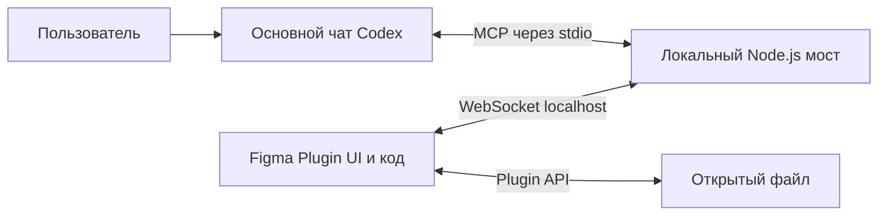

# План реализации: управление Figma из основного чата Codex

> Плановый документ. Реализацию начинать по отдельному запросу пользователя. Целевая среда — Windows, личный Figma Starter, Codex Desktop/CLI.

## Цель

Пользователь пишет в обычном чате Codex. Codex получает MCP-инструменты для чтения открытого файла Figma и создания/редактирования экранов. Внутренний чат в Figma не нужен.

## Архитектура

- Codex загружает локальный MCP-сервер как свой инструмент. Он обслуживает MCP по stdio и запускает локальный WebSocket-сервер для плагина Figma.
- Плагин подключается к мосту и выполняет ограниченный набор типизированных операций над активным файлом.
- Общение, история диалога и вход остаются в Codex. Плагину не нужны чат, логин ChatGPT, Codex app-server или API-ключ.
- Установка плагина для личной разработки — через Figma Desktop → Plugins → Development. Проверить работу на бесплатном Figma Starter.
- Удаление и другие потенциально разрушительные действия требуют подтверждения пользователя. Не запускать произвольный JS из модели.

## Объём первой версии

**Входит:** сведения об открытом файле и страницах; дерево выбранных узлов с пагинацией; локальные стили; PNG-превью узла; создание страницы и экранов из редактируемых фреймов, текста и прямоугольников; изменение имени, текста, геометрии, заливки и авторазметки; подтверждение удаления узла.

**Не входит:** публикация в Figma Community, облачный сервер, совместное управление разными файлами, импорт внешних библиотек, FigJam/Slides, генерация изображений и произвольное выполнение кода.

## Основной сценарий

1. Пользователь запускает мост (или Codex запускает его как MCP-процесс) и открывает локальный плагин в Figma.
2. Плагин подключается к адресу loopback. Мост допускает один активный файл и связывает его с Codex MCP-сессией.
3. В основном чате пользователь просит Codex изучить макет или создать/изменить экран.
4. Codex вызывает MCP-инструмент. Мост передаёт типизированный запрос подключённому плагину; Figma Plugin API исполняет его и возвращает результат.
5. Для удаления мост показывает в Figma название, тип и ID узла; команда выполняется только после явного подтверждения.
6. При закрытии плагина ожидающие запросы завершаются понятной ошибкой; повторное подключение не повторяет ранее выполненную запись.

## План работ

### 1. Проверить точки интеграции

- Зафиксировать версии Node.js, npm, Codex и Figma Desktop.
- Минимально проверить, что Codex загружает локальный MCP-сервер по stdio и показывает тестовый инструмент.
- Проверить WebSocket-подключение из dev-плагина Figma к localhost, нужные поля `networkAccess/devAllowedDomains` и фактический Origin.
- Записать ограничения и подтверждённые команды запуска в README. Не проектировать передачу/вход в Codex через app-server.

### 2. Создать каркас проекта

- Настроить TypeScript, сборку плагина (main/UI) и Node.js MCP-процесса, команды `build`, `typecheck`, `test`.
- Добавить пример manifest без выдуманного Figma ID; настоящий ID получить через создание личного dev-плагина.
- Внести зависимости и lockfile; исключить сборку, секреты и локальные настройки из Git.
- Убедиться, что плагин открывает минимальное окно статуса, а MCP-сервер запускается из Codex.

### 3. Описать безопасный протокол

- Задать общие типы и Zod-схемы для MCP-аргументов, WebSocket-запросов/ответов и ошибок.
- Ограничить глубину дерева, количество узлов, текст, размеры и размер изображений.
- Проверять все данные и в MCP-сервере, и в плагине. Не принимать имена методов или код от модели вне allowlist.
- Тестировать неверные ID, неизвестные методы, слишком большие запросы и разрыв связи.

### 4. Реализовать подключение

- Мост слушает только `127.0.0.1`; доступ к Figma — только по локальному WebSocket.
- Проверять Origin и рукопожатие с краткоживущим случайным токеном, не помещая его в URL, репозиторий или логи.
- Привязать запросы к активному сеансу и `requestId`; добавить тайм-ауты, предел сообщения и корректную очистку ожидающих запросов.
- На disconnect сообщать Codex `FIGMA_DISCONNECTED`; не повторять write-команды автоматически.

### 5. Реализовать чтение Figma

MCP-инструменты первой итерации:
- `get_file_overview`: имя, страницы, активная страница и выделение.
- `get_node_tree`: узлы по ID, глубина и страницы результатов.
- `get_node_preview`: ограниченное PNG-превью.
- `get_local_styles`: локальные текстовые и цветовые стили.

Загружать только запрошенную страницу/узел средствами динамической загрузки Figma. Не выгружать весь файл без необходимости. Возвращать JSON с нужными свойствами, не сериализовать объекты Figma целиком.

### 6. Реализовать создание и правки

Инструменты:
- `create_page`
- `create_screen` — экран-фрейм с вложенными frame/text/rectangle и авторазметкой.
- `update_node` — только явные разрешённые свойства.
- `delete_node` — только после подтверждения.

Сначала валидировать всю операцию. Перед записью текста загружать требуемые шрифты. Ограничить типы узлов, число дочерних объектов и вложенность. При ошибке создания удалить только узлы, созданные этой операцией; исходные узлы не менять в rollback.

### 7. Подключить MCP к Codex

- Настроить локальный MCP-сервер через поддерживаемый Codex механизм конфигурации; начать с stdio.
- Ограничить список инструментов только Figma-операциями. Описания явно сообщают, что меняют инструменты записи.
- Проверить запуск после перезапуска Codex и поведение при недоступном плагине.
- Использовать авторизацию самого Codex. Не хранить в проекте ChatGPT cookies, пользовательские токены или API-ключи.

### 8. Приёмка в Figma

На отдельном тестовом файле:
- получить обзор файла и прочитать выбранный экран;
- создать новый экран из редактируемых слоёв;
- изменить заголовок и цвет;
- отменить удаление и проверить, что узел остался;
- подтвердить удаление и проверить, что удалён только указанный узел;
- закрыть плагин во время запроса, затем переподключить;
- проверить работу на Figma Starter и записать фактически проверенные шаги установки.

## Минимальный набор MCP-инструментов

| Инструмент | Действие |
| --- | --- |
| `get_file_overview` | Читает имя, страницы и выделение |
| `get_node_tree` | Читает структуру узлов |
| `get_node_preview` | Возвращает PNG-превью |
| `get_local_styles` | Читает стили |
| `create_page` | Создаёт страницу |
| `create_screen` | Создаёт редактируемый экран |
| `update_node` | Меняет явно перечисленные свойства |
| `delete_node` | Удаляет один узел после подтверждения |

## Безопасность и ошибки

- MCP-инструменты доступны только локальному Codex; WebSocket слушает loopback.
- Валидация по allowlist; никакого `eval`, shell-команд или произвольного JavaScript из модели.
- Токен сеанса краткоживущий; секреты не логировать и не коммитить.
- Удаление подтверждается в интерфейсе плагина; отмена и тайм-аут блокируют операцию.
- Ошибки: `NOT_CONNECTED`, `FIGMA_DISCONNECTED`, `INVALID_ARGUMENT`, `NODE_NOT_FOUND`, `FONT_UNAVAILABLE`, `CONFIRMATION_REQUIRED`, `TIMEOUT`, `FIGMA_API_ERROR`. Отображать понятный текст в основном чате через результат MCP.

## Критерии готовности

- Codex из основного чата видит и читает открытый файл Figma.
- Codex создаёт новый экран из редактируемых слоёв и затем правит его свойства.
- Удаление не происходит без явного подтверждения в плагине.
- Плагин работает на личном Starter-файле в Figma Desktop.
- Проверки сборки, типов и тестов проходят; README содержит проверенную инструкцию установки.
- Локальный мост и плагин не требуют отдельного чата или логина ChatGPT внутри Figma.

## Официальные документы для проверки при реализации

- [Codex MCP servers](https://developers.openai.com/codex/mcp/)
- [Figma Plugin manifest и доступ к сети](https://developers.figma.com/docs/plugins/manifest/)
- [Figma dynamic page loading](https://developers.figma.com/docs/plugins/migrating-to-dynamic-loading/)
- [Figma working with text](https://developers.figma.com/docs/plugins/working-with-text/)
- [MCP TypeScript SDK](https://github.com/modelcontextprotocol/typescript-sdk)
