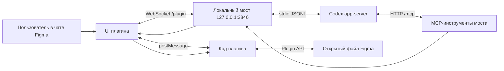

# Figma ↔ Codex MCP Bridge Implementation Plan

> **For agentic workers:** REQUIRED SUB-SKILL: Use superpowers:subagent-driven-development (recommended) or superpowers:executing-plans to implement this plan task-by-task. Steps use checkbox (`- [ ]`) syntax for tracking. The user requested this plan in the project root. Do not start implementation until the user asks for it.

**Goal:** Личный плагин Figma с чатом: Codex читает открытый файл, создаёт экраны и меняет слои по командам пользователя.

**Architecture:** Окно плагина общается с локальным Node.js-мостом по WebSocket. Мост запускает Codex app-server и предоставляет ему собственный MCP-сервер с ограниченным набором инструментов. Запросы инструментов идут через мост в код плагина, который читает и меняет открытый файл через Figma Plugin API.

**Tech Stack:** TypeScript, Node.js 24, Figma Plugin API, Codex app-server (stdio JSONL), MCP Streamable HTTP, WebSocket, Zod, esbuild, Vitest. Windows — первая целевая платформа.

---

## 1. Решения и границы

- **Чат внутри Figma.** Пользователь открывает плагин в Figma Design, пишет запрос и видит ход работы и ответ там же.
- **Только открытый файл.** Плагин работает с файлом, в котором запущен. Он перечисляет все страницы, затем загружает нужную страницу по запросу. «Передать файл» означает дать Codex структурированный доступ к страницам, слоям, стилям и превью, а не выгрузить закрытый формат `.fig` одним файлом.
- **Личный запуск.** Первая версия устанавливается через `Plugins → Development` в Figma Desktop. Публикация в Community и облачный сервер в эту версию не входят.
- **Вход через ChatGPT.** Мост использует Codex app-server и его `account/login/start` с браузерным входом. API-ключ OpenAI не требуется. Лимиты использования Codex определяются тарифом ChatGPT.
- **Собственный MCP.** Официальный Figma MCP не используется в рабочем пути плагина. Данные читает Figma Plugin API; Codex получает их от нашего локального MCP. Это архитектурный вывод: лимит чтения официального Figma MCP не расходуется запросами собственного моста. Проверить на живом файле.
- **Без произвольного кода в Figma.** MCP-инструменты принимают только типизированные операции над узлами. `eval`, запуск JavaScript модели и произвольные shell-команды через MCP не предоставляются.
- **Область первой версии.** Чтение страниц, выделения, дерева узлов, локальных стилей и PNG-превью. Создание страниц и экранов из фреймов, текста и прямоугольников. Правка имени, текста, размеров, позиции, заливки и авторазметки. Удаление с подтверждением в чате.
- **Не входят в первую версию:** генерация изображений, импорт внешних библиотек, компоненты и варианты, FigJam/Slides, одновременная работа с несколькими файлами, публикация плагина.

## 2. Схема обмена



1. Мост стартует, слушает только `127.0.0.1:3846` и один раз показывает случайный токен сеанса в терминале. Токен не записывать в файл или обычный журнал событий.
2. Пользователь открывает плагин, вставляет токен. UI подключается к `/plugin` и первой командой отправляет токен. Токен не включать в URL, логи или ответы Codex.
3. Мост запускает `codex app-server --listen stdio://` после готовности `/mcp`, передавая адрес MCP через аргументы `-c`. Пользователь нажимает «Войти через ChatGPT»; полученный `authUrl` открывается через `figma.openExternal`.
4. После входа UI отправляет текст запроса. Мост создаёт или продолжает Codex thread; app-server стримит события диалога.
5. Codex вызывает MCP-инструмент. Мост пересылает типизированную операцию в главный поток плагина. Тот выполняет Figma Plugin API и возвращает результат по тому же `requestId`.
6. При закрытии плагина незавершённые запросы получают явную ошибку `FIGMA_DISCONNECTED`; новый файл требует нового сеанса плагина. Один активный Figma-файл на мост.

## 3. Структура будущего проекта

| Путь | Ответственность |
| --- | --- |
| `package.json`, `package-lock.json` | Зафиксированные зависимости и команды `build`, `test`, `typecheck`, `start`. |
| `tsconfig.plugin.json`, `tsconfig.bridge.json` | Раздельные типы для Figma sandbox/UI и Node.js. |
| `scripts/build.mjs` | Собирает код плагина и встраивает CSS/JS в `dist/plugin/ui.html`; собирает мост. |
| `manifest.json` | Личный manifest с ID, созданным Figma; Design mode, dynamic-page, доступ только к локальному мосту. |
| `src/shared/protocol.ts` | Типы сообщений UI ↔ мост ↔ код плагина, коды ошибок, схемы Zod. |
| `src/plugin/main.ts` | `figma.showUI`, маршрутизация сообщений, `figma.openExternal`, уведомления. |
| `src/plugin/read.ts` | Метаданные файла, страницы, дерево узлов, стили, выделение, PNG. |
| `src/plugin/write.ts` | Создание экрана и страниц; проверенные изменения и удаление узлов. |
| `src/plugin/ui.html`, `src/plugin/ui.css`, `src/plugin/ui.ts` | Чат, подключение, вход, поток событий, подтверждение удаления. |
| `src/bridge/http.ts` | Loopback HTTP, WebSocket, проверка токена и Origin. |
| `src/bridge/session.ts` | Один активный плагин, запросы по `requestId`, тайм-ауты и разрыв связи. |
| `src/bridge/mcp.ts` | MCP-инструменты, входные схемы, маршрутизация в Figma. |
| `src/bridge/codex.ts` | Процесс app-server, JSONL, вход, threads, turns, события и ошибки. |
| `src/bridge/index.ts` | Запуск, остановка и связывание частей моста. |
| `tests/*.test.ts` | Контрактные тесты протокола, операций, MCP и app-server. |
| `README.md` | Установка, вход, запуск, ручная проверка и решение типичных ошибок. |
| `.gitignore` | `node_modules/`, `dist/`, локальные секреты и временные файлы. |

`manifest.json` должен получить настоящий `id` из диалога **New plugin** в Figma. Не подставлять чужой опубликованный ID. Для сборки до регистрации допустим отдельный `manifest.example.json` без `id`; живой manifest создаётся на этапе установки.

## 4. Контракты первой версии

### 4.1 Сообщения моста

Все сообщения — JSON с полем `type`; запросы и ответы имеют `requestId: string`. Предел одного сообщения: 4 МиБ; PNG больше лимита отклоняется с предложением уменьшить размер. После аутентификации UI сообщает `fileName`, `currentPageId` и `selectionIds`; при изменении выделения обновляет их. Не передавать `figma.fileKey`: Figma ограничивает доступ к нему для приватных плагинов.

```ts
type PluginRequest =
  | { type: "plugin.call"; requestId: string; method: "file.overview"; args: {} }
  | { type: "plugin.call"; requestId: string; method: "node.tree"; args: { nodeId: string; depth: number; offset: number; limit: number } }
  | { type: "plugin.call"; requestId: string; method: "node.preview"; args: { nodeId: string; scale: number } }
  | { type: "plugin.call"; requestId: string; method: "styles.list"; args: {} }
  | { type: "plugin.call"; requestId: string; method: "page.create"; args: { name: string } }
  | { type: "plugin.call"; requestId: string; method: "screen.create"; args: ScreenSpec }
  | { type: "plugin.call"; requestId: string; method: "node.update"; args: UpdateNodeSpec }
  | { type: "plugin.call"; requestId: string; method: "node.delete"; args: { nodeId: string; confirmationId: string } };

type PluginReply =
  | { type: "plugin.result"; requestId: string; value: unknown }
  | { type: "plugin.error"; requestId: string; code: string; message: string };

type ConfirmationMessage =
  | { type: "confirmation.request"; confirmationId: string; nodeId: string; nodeName: string; nodeType: string }
  | { type: "confirmation.reply"; confirmationId: string; accepted: boolean };
```

`ScreenSpec` — один корневой фрейм (экран) с `pageId`, `name`, `width`, `height`, `x`, `y`, опциональной авторазметкой и деревом до 200 дочерних узлов. Дочерние типы: `frame`, `text`, `rectangle`; вложенность ≤ 8. Для `frame` разрешены `children`, `layoutMode`, `itemSpacing`, `paddingLeft/Right/Top/Bottom`; для `text` — `characters`, `fontSize`, `fontFamily`, `fontStyle`; для `rectangle` — `cornerRadius`. Общие поля: `name`, `x`, `y`, `width`, `height`, `fill`. Цвет — `#RRGGBB`, размеры 1–10 000 px, текст ≤ 20 000 символов. Координаты дочернего узла относительны родителю; при авторазметке порядок задаёт массив `children`, а `x/y` игнорируются. `UpdateNodeSpec` — `nodeId` плюс явный список изменяемых полей; пустой patch и неизвестные поля отклоняются. Схемы должны совпадать в MCP и плагине.

### 4.2 MCP-инструменты

| Инструмент | Аргументы | Результат |
| --- | --- | --- |
| `get_file_overview` | `{}` | Имя файла, список страниц, текущая страница, выделение. |
| `get_node_tree` | `nodeId, depth=2, offset=0, limit=50` | Тип, имя, геометрия, видимость, текст/заливки по типу, страница детей. |
| `get_node_preview` | `nodeId, scale=1` | PNG как MCP image content; ограничение размера. |
| `get_local_styles` | `{}` | Цветовые и текстовые стили файла; пагинация, если нужна. |
| `create_page` | `name` | ID новой страницы. |
| `create_screen` | `ScreenSpec` | ID корневого фрейма и созданных дочерних узлов. |
| `update_node` | `UpdateNodeSpec` | ID и итоговые свойства. |
| `delete_node` | `nodeId, confirmationId` | ID удалённого узла. |

У каждого инструмента указать реальный побочный эффект в MCP metadata. `delete_node` требует подтверждения в UI: мост создаёт одноразовый `confirmationId`, показывает имя/тип/ID узла, принимает ответ пользователя и лишь затем передаёт операцию в плагин. Отмена или тайм-аут 60 секунд прекращают вызов. Подтверждение действует только для указанного файла, узла и одного вызова. Удаление страницы не поддерживать. Если сам app-server запрашивает разрешение на вызов MCP-инструмента, мост также передаёт этот запрос в UI и возвращает выбранный пользователем ответ.

### 4.3 Ошибки и ограничения

Коды: `NOT_CONNECTED`, `FIGMA_DISCONNECTED`, `AUTH_REQUIRED`, `INVALID_ARGUMENT`, `NODE_NOT_FOUND`, `UNSUPPORTED_NODE`, `FONT_UNAVAILABLE`, `CONFIRMATION_REQUIRED`, `TIMEOUT`, `CODEX_FAILED`. UI показывает понятный текст и действие для повторения. Не выдавать raw стек и токен пользователю или модели. Предел вызова Figma API — 30 секунд; для превью — 60 секунд. Одновременно выполнять одну запись, чтения ограничить четырьмя параллельными вызовами. При ошибке создания экрана удалить только узлы, созданные в этом вызове; существующие узлы не трогать.

## 5. Задачи реализации

### Task 1: Каркас и проверка совместимости

**Files:** Create `package.json`, `package-lock.json`, `tsconfig.plugin.json`, `tsconfig.bridge.json`, `scripts/build.mjs`, `.gitignore`, `manifest.example.json`, `src/plugin/main.ts`, `src/plugin/ui.html`, `src/plugin/ui.css`, `src/plugin/ui.ts`, `src/bridge/index.ts`.

- [ ] Убедиться, что `node --version`, `npm.cmd --version`, `codex.cmd --version` работают. Зафиксировать версии в `README.md`.
- [ ] Создать Git-репозиторий, если папка по-прежнему без `.git`: `git init`. Это даст небольшие проверяемые коммиты.
- [ ] Добавить зависимости: `@modelcontextprotocol/server`, `@modelcontextprotocol/node`, `zod`, `ws`; dev-зависимости: `@figma/plugin-typings`, `@types/ws`, `@types/node`, `typescript`, `esbuild`, `tsx`, `vitest`. Зафиксировать lockfile.
- [ ] Добавить скрипты `build`, `typecheck`, `test`, `start`. `start` запускает собранный мост через Node, `build` создаёт `dist/plugin/main.js`, `dist/plugin/ui.html`, `dist/bridge/index.js`.
- [ ] Добавить минимальные входные файлы: код плагина показывает окно `figma.showUI(__html__)`; UI сообщает «Мост пока не подключён»; мост запускается и выводит адрес для будущего сервера. Подключение и логика появятся в следующих задачах.
- [ ] Собрать минимальный manifest: `api: "1.0.0"`, `editorType: ["figma"]`, `documentAccess: "dynamic-page"`, `main: "dist/plugin/main.js"`, `ui: "dist/plugin/ui.html"`, `networkAccess.allowedDomains: ["none"]`, `devAllowedDomains: ["ws://127.0.0.1:3846"]`. При регистрации Figma заменить пример реальным manifest с её ID; проверить пути от корня проекта.
- [ ] Проверить `npm.cmd run typecheck` и `npm.cmd run build`. Ожидание: 0 ошибок и три указанных артефакта сборки. Первый тест появится в Task 2.
- [ ] Коммит: `chore: scaffold figma codex bridge`.

**Риск:** актуальная MCP TypeScript SDK разделена на пакеты `@modelcontextprotocol/server` и `@modelcontextprotocol/node`; API закрепить установленным lockfile и проверить минимальным запуском до остальных задач.

### Task 2: Общий протокол и валидация

**Files:** Create `src/shared/protocol.ts`, `tests/protocol.test.ts`.

- [ ] Сначала написать тесты Zod-схем: неизвестный `method`, отрицательные размеры, неверный цвет, дерево глубже 8, >200 узлов и пустой patch отклоняются; допустимый экран проходит.
- [ ] Запустить `npm.cmd test -- tests/protocol.test.ts`; убедиться, что тесты падают из-за отсутствия схем.
- [ ] Определить `ScreenSpec`, `UpdateNodeSpec`, `PluginRequest`, `PluginReply`, chat-события и коды ошибок. Экспортировать схемы и типы из одного файла.
- [ ] Запустить `npm.cmd test -- tests/protocol.test.ts` и `npm.cmd run typecheck`; ожидание: PASS.
- [ ] Коммит: `feat: define bridge protocol`.

### Task 3: Чтение файла через Figma Plugin API

**Files:** Create `src/plugin/read.ts`, `tests/read.test.ts`; Modify `src/plugin/main.ts`.

- [ ] Сначала тестировать: `file.overview` возвращает страницы без загрузки их содержимого; `node.tree` вызывает `PageNode.loadAsync()` перед чтением чужой страницы; `offset/limit` ограничивают детей; неизвестный ID даёт `NODE_NOT_FOUND`.
- [ ] Запустить тест и увидеть падение по отсутствующим функциям.
- [ ] Реализовать `getFileOverview(figma)`, `getNodeTree(figma,args)`, `getLocalStyles(figma)`, `getNodePreview(figma,args)`. Для узла по ID использовать `figma.getNodeByIdAsync`; для другой страницы — `page.loadAsync()`. Не вызывать `figma.loadAllPagesAsync()` в обычном пути.
- [ ] Сериализовать только нужные поля, не возвращать Figma-объекты целиком. Для превью использовать `node.exportAsync({format:"PNG", constraint:{type:"SCALE",value:scale}})` и ограничить байты до отправки.
- [ ] Запустить тесты и сборку; проверить вручную на тестовом файле с двумя страницами.
- [ ] Коммит: `feat: read figma document on demand`.

### Task 4: Создание экранов и правка слоёв

**Files:** Create `src/plugin/write.ts`, `tests/write.test.ts`; Modify `src/plugin/main.ts`.

- [ ] Сначала тестировать создание страницы, корневого фрейма и вложенных фрейма/текста/прямоугольника; обновление существующего узла; отказ при неверном parent или типе; уборку созданных узлов после ошибки.
- [ ] Запустить тесты и увидеть падение по отсутствующим функциям.
- [ ] Реализовать `createPage`, `createScreen`, `updateNode`, `deleteNode`. Сначала валидировать весь запрос, затем выполнять запись. Разрешать создание только внутри выбранной страницы; `page.loadAsync()` перед вставкой.
- [ ] Перед изменением `TextNode.characters`, `fontSize` и `fontName` вызывать `figma.loadFontAsync`; для уже оформленного текста учитывать смешанные шрифты через `getRangeAllFontNames`. Ошибку отсутствующего шрифта возвращать как `FONT_UNAVAILABLE`.
- [ ] В `createScreen` собирать созданные ID и удалять их при частичной ошибке. Возвращать ID экрана и дочерних узлов; не удалять существующие элементы в rollback.
- [ ] Запустить `npm.cmd test -- tests/write.test.ts`, `npm.cmd run typecheck`, `npm.cmd run build`; вручную создать экран на отдельной тестовой странице и проверить Undo.
- [ ] Коммит: `feat: create and edit figma screens`.

### Task 5: Локальный канал и сеанс файла

**Files:** Create `src/bridge/http.ts`, `src/bridge/session.ts`, `tests/session.test.ts`, `tests/http.test.ts`.

- [ ] Сначала тестировать: неверный токен не подключает плагин; второй плагин не перехватывает активный сеанс; ответ с чужим `requestId` игнорируется; разрыв связи завершает ожидающие запросы; просроченный запрос удаляется из памяти.
- [ ] Запустить тесты и увидеть падение.
- [ ] Генерировать 256-битный токен при запуске. Слушать лишь `127.0.0.1:3846`. `/plugin` принимает WebSocket; первое сообщение должно быть `hello` с токеном за 5 секунд. Отбрасывать неизвестный Origin; отдельно проверить фактический Origin в Figma Desktop.
- [ ] Реализовать `session.call(method,args,timeoutMs)` с уникальным `requestId`, таблицей ожидающих ответов, лимитом размеров и ошибками `FIGMA_DISCONNECTED`/`TIMEOUT`.
- [ ] Проверить, что WebSocket не использует токен в URL, а секреты не попадают в логи. Запустить оба тестовых файла; ожидание: PASS.
- [ ] Коммит: `feat: connect local figma session`.

### Task 6: MCP-сервер для Codex

**Files:** Create `src/bridge/mcp.ts`, `tests/mcp.test.ts`; Modify `src/bridge/http.ts`, `src/bridge/index.ts`.

- [ ] Сначала тестировать `initialize`, `tools/list`, допустимый `tools/call`, ошибку при отсутствии Figma, запрет POST `/mcp` без `Authorization: Bearer` и отказ в несуществующем инструменте.
- [ ] Запустить тесты и увидеть падение.
- [ ] Поднять MCP Streamable HTTP на `/mcp` через официальный SDK. Сначала проверить текущий пример SDK для Node, затем закрепить работающую версию в lockfile. Не писать собственный MCP JSON-RPC парсер.
- [ ] Зарегистрировать восемь инструментов из §4.2 со схемами, аннотациями чтения/записи и краткими инструкциями серверу: работать только с активным файлом, сначала получать обзор, перед удалением запрашивать подтверждение.
- [ ] Привязать Bearer-token MCP к тому же локальному сеансу. Позже app-server получает токен через переменную окружения, а не через аргументы CLI.
- [ ] Проверить MCP Inspector или клиентским тестом: `initialize → tools/list → get_file_overview`; без плагина ожидается контролируемая ошибка `NOT_CONNECTED`.
- [ ] Коммит: `feat: expose figma mcp tools`.

### Task 7: Codex app-server и вход через ChatGPT

**Files:** Create `src/bridge/codex.ts`, `tests/codex.test.ts`; Modify `src/bridge/index.ts`.

- [ ] Сначала тестировать JSONL: `initialize → initialized → account/read`; корреляцию ответов по `id`; поток `item/agentMessage/delta`; `turn/completed` со статусами `completed`, `failed`, `interrupted`; завершение дочернего процесса.
- [ ] Запустить тесты и увидеть падение.
- [ ] Запускать установленный Codex CLI с `app-server --listen stdio://`. В Windows искать `codex.cmd`; передавать только фиксированные аргументы без пользовательского текста через shell. До реализации запуска проверить совместимость текущего CLI с `codex.cmd app-server --help`.
- [ ] Передать локальный MCP через `-c` overrides: `mcp_servers.figma_local.url="http://127.0.0.1:3846/mcp"`, `mcp_servers.figma_local.bearer_token_env_var="FIGMA_BRIDGE_TOKEN"`, `mcp_servers.figma_local.required=true`. Установить `FIGMA_BRIDGE_TOKEN` только в окружении дочернего процесса. Не менять глобальный `~/.codex/config.toml`.
- [ ] Реализовать `account/read`, `account/login/start` (`type:"chatgpt"`), `thread/start`/`thread/resume`, `turn/start`/`turn/interrupt`. Для чата задать `cwd` в пустой локальной рабочей папке моста, `sandboxPolicy:{type:"readOnly"}` и `approvalPolicy:"onRequest"`; MCP-записи разрешать согласно подтверждённым инструментам. Сохранять thread ID только в памяти процесса для первой версии.
- [ ] Проверить `mcpServerStatus/list`, что `figma_local` и инструменты загрузились. Локально проверить `account/read`; если входа нет, показать действие входа, а не запрашивать API-ключ. Обработать `account/login/completed` и запросы разрешения от app-server.
- [ ] Коммит: `feat: drive codex app server`.

### Task 8: Чат в Figma

**Files:** Modify `src/plugin/ui.html`, `src/plugin/ui.css`, `src/plugin/ui.ts`, `src/plugin/main.ts`, `scripts/build.mjs`; Create `tests/ui-state.test.ts`.

- [ ] Сначала тестировать модель состояния UI: `disconnected → paired → login-required → ready → running → ready`; ошибки и переподключение; запрет второй отправки во время активного turn.
- [ ] Запустить тесты и увидеть падение.
- [ ] Сделать окно с полями «токен моста», «войти через ChatGPT», чат, текущий файл/страница/выделение, статус, кнопки «Отправить» и «Остановить». Использовать переменные темы Figma; сообщения и ошибки выводить текстом, без HTML-инъекций.
- [ ] WebSocket поддерживает пары запрос/ответ и поток событий. UI пересылает `plugin.call` в `figma.ui.onmessage` через `parent.postMessage`; главный поток возвращает `plugin.result`/`plugin.error`. Для `authUrl` главный поток вызывает `figma.openExternal` только после проверки HTTPS и домена входа.
- [ ] Показывать имя, тип и ID удаляемого узла; кнопки «Удалить»/«Отмена» возвращают ответ мосту. Повторное подключение не должно повторять операцию записи.
- [ ] Собрать HTML с локально встроенными JS/CSS; не подключать внешние скрипты. Проверить визуально Figma Desktop в светлой и тёмной темах, а также `npm.cmd run build` и UI-тесты.
- [ ] Коммит: `feat: add figma codex chat`.

### Task 9: Сквозная проверка и защита от ошибок

**Files:** Create `tests/integration.test.ts`; Modify `src/bridge/http.ts`, `src/bridge/session.ts`, `src/bridge/mcp.ts`, `src/plugin/write.ts` по найденным проблемам.

- [ ] Тестовый WebSocket-плагин отвечает на `file.overview` и `screen.create`; MCP-клиент вызывает эти инструменты, проверяет результаты и ID.
- [ ] Проверить отказ: неверный токен, чужой Origin, закрытие плагина посреди tool call, запрос на другой файл, повторный `requestId`, неверный Figma ID, слишком большое дерево, недоступный шрифт.
- [ ] Проверить сериализацию записей. Любой `delete_node` без одноразового подтверждения должен закончиться `CONFIRMATION_REQUIRED` без вызова Figma API.
- [ ] Запустить `npm.cmd run typecheck`, `npm.cmd test`, `npm.cmd run build`, `git diff --check`; сохранить команды и ожидаемый результат в README.
- [ ] Коммит: `test: cover end to end bridge flow`.

### Task 10: Установка и живая приёмка на Starter Figma

**Files:** Create/Modify `manifest.json`, `README.md`; Modify другие файлы только по результатам приёмки.

- [ ] В Figma Desktop открыть тестовый Design-файл. Через `Plugins → Development → New plugin → Figma design → Custom UI` получить ID и сохранить manifest в корне как `manifest.json`. Указать пути к собранным файлам и доступ `ws://127.0.0.1:3846` в `devAllowedDomains`.
- [ ] Выполнить `npm.cmd install`, `npm.cmd run build`, `npm.cmd start`. Убедиться, что мост слушает только loopback, а терминал показывает токен сеанса.
- [ ] Запустить плагин в Figma, вставить токен, пройти вход через ChatGPT. Проверить `account/read`, что app-server авторизован, и `mcpServerStatus/list`, что наш MCP доступен.
- [ ] Создать две страницы и несколько исходных слоёв. В чате попросить: «Покажи страницы и выделение», «Создай экран 1440×900 с шапкой и карточками», «Поменяй заголовок и цвет», «Удалить карточку». Подтвердить удаление. Проверить, что результат состоит из редактируемых слоёв Figma, а не одной картинки.
- [ ] Закрыть плагин во время чтения, затем открыть снова и переподключить. Проверить понятное сообщение об ошибке и отсутствие зависших запросов.
- [ ] Зафиксировать в README фактический результат на бесплатном Starter, ограничения и точные шаги запуска. Если живой вход или Figma-доступ нельзя завершить без действий владельца аккаунта, оставить готовую сборку и отдельно записать непроверенный шаг; локальные тесты не выдавать за живую приёмку.
- [ ] Финальный прогон `npm.cmd run typecheck`, `npm.cmd test`, `npm.cmd run build`, `git diff --check`; коммит `docs: add installation and acceptance guide`.

## 6. Критерии готовности

- [ ] Чат открывается внутри тестового Figma Design-файла на Starter.
- [ ] Пользователь входит через ChatGPT, не вводя OpenAI API-ключ в плагин.
- [ ] Codex видит список страниц и нужные узлы **открытого файла**, включая страницу вне текущей после её адресной загрузки.
- [ ] Команда из чата создаёт новый экран из редактируемых Figma-слоёв; следующая команда меняет созданный текст и цвет.
- [ ] Удаление требует явного подтверждения в UI и не срабатывает после отмены.
- [ ] Ошибки входа, потери связи, шрифта и неверного ID видны в чате с понятным действием.
- [ ] HTTP/WebSocket доступны только на `127.0.0.1`; без токена MCP и UI отклоняют запросы; токен показывается только один раз в терминале и отсутствует в URL/файлах журналов/репозитории.
- [ ] `typecheck`, тесты и сборка проходят; README позволяет повторить установку с чистой копии проекта.

## 7. Источники, которые перепроверить при реализации

- [Figma Plugin API: manifest и сетевой доступ](https://developers.figma.com/docs/plugins/manifest/) — ID, `documentAccess`, `networkAccess`.
- [Figma: динамическая загрузка страниц](https://developers.figma.com/docs/plugins/migrating-to-dynamic-loading/) — `PageNode.loadAsync`, `getNodeByIdAsync`.
- [Figma: работа с текстом](https://developers.figma.com/docs/plugins/working-with-text/) — загрузка шрифтов.
- [Figma MCP: лимиты Starter](https://developers.figma.com/docs/figma-mcp-server/rate-limits-access/) — сравнение с официальным сервером.
- [Codex App Server](https://learn.chatgpt.com/docs/app-server/) — JSONL, вход, threads/turns, события.
- [Codex MCP configuration](https://learn.chatgpt.com/docs/extend/mcp/) — HTTP MCP и Bearer-token из окружения.
- [MCP TypeScript SDK](https://github.com/modelcontextprotocol/typescript-sdk/blob/main/docs/server.md) — актуальная версия транспорта и регистрации инструментов.

## 8. Контрольные точки

После Task 4 плагин должен локально читать и менять Figma без Codex. После Task 6 MCP Inspector должен управлять тем же тестовым файлом. После Task 8 чат должен работать через Codex с ChatGPT-входом. Только Task 10 подтверждает работу в реальном файле Figma на бесплатном тарифе.
